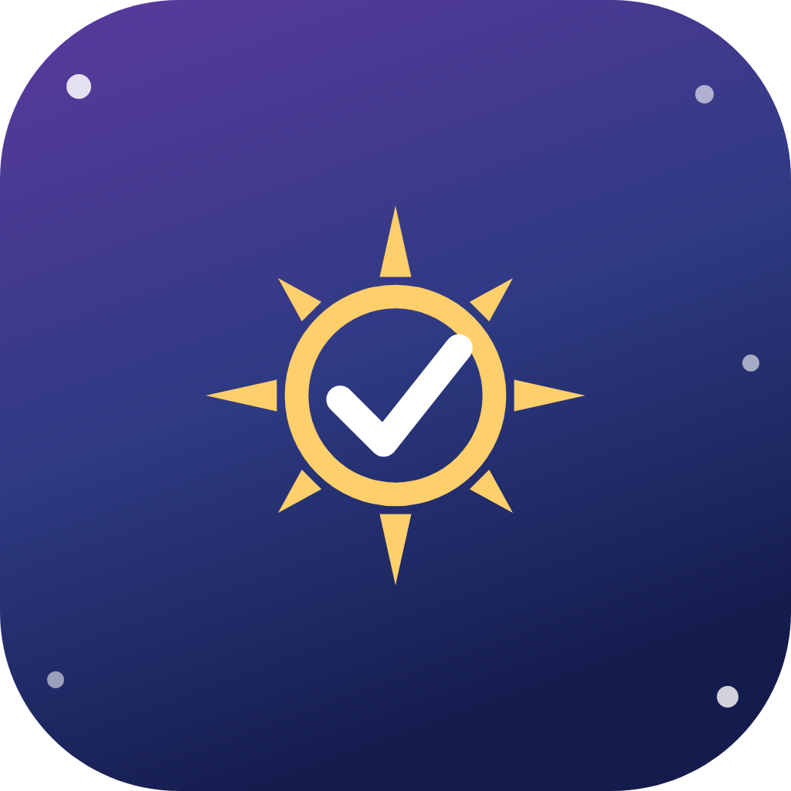
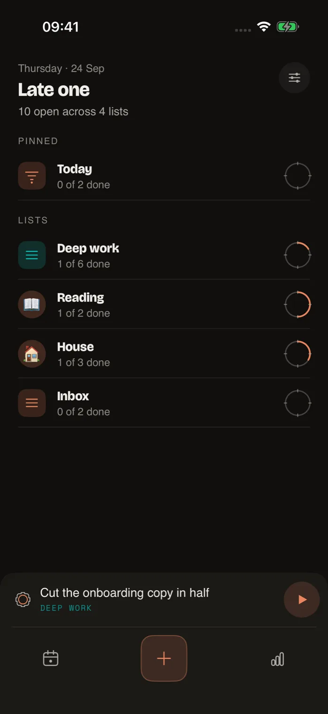
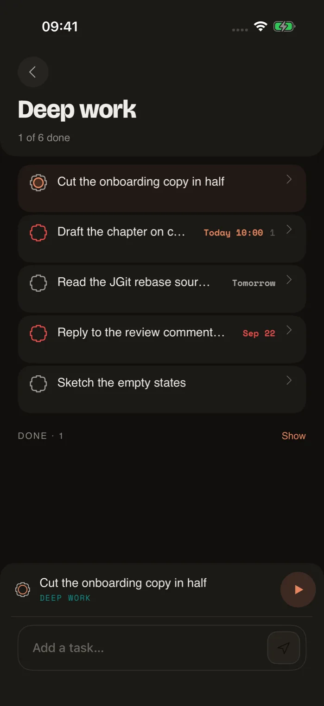
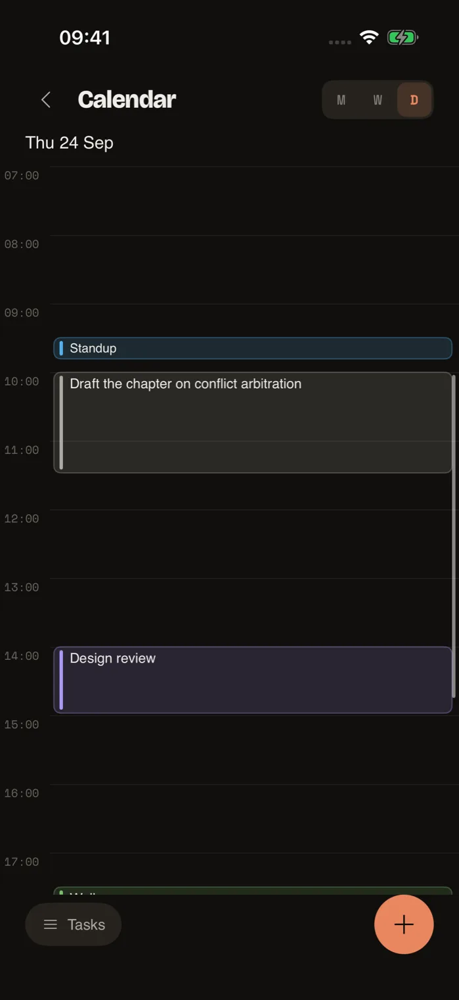
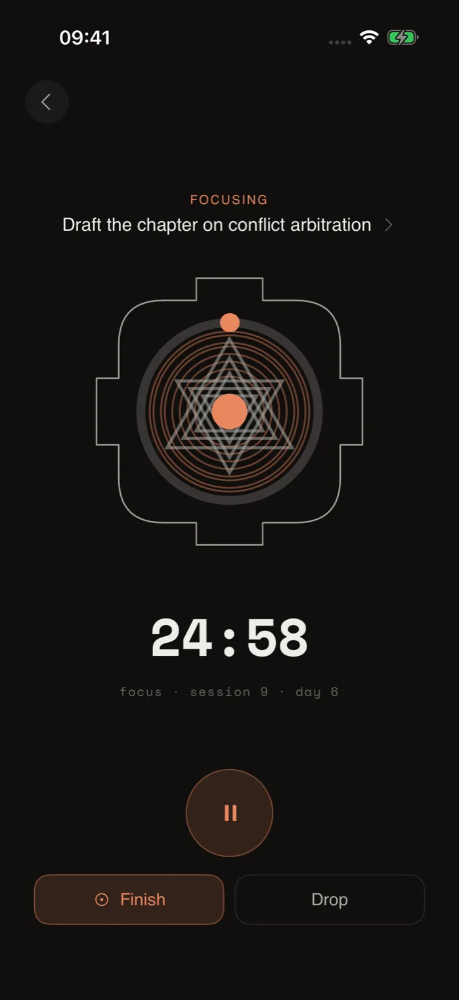

<p align="center">
  
</p>

<h1 align="center">Yantra</h1>

<p align="center">
  A todo app whose notes are as good as a notes app's.<br>
  Your tasks, notes and drawings are plain Markdown in a git repository you own.
</p>

<p align="center">
  <a href="https://batunii.github.io/YANTRA/">Website</a> ·
  <a href="ARCHITECTURE.md">Architecture</a> ·
  <a href="DESIGN.md">Design language</a> ·
  <a href="docs/PRIVACY.md">Privacy</a> ·
  <a href="RELEASE.md">Releasing</a>
</p>

<p align="center">
  
  
  
  
</p>

---

## What it is

Not a notes app that tracks tasks. The spine is a task list, and the whole thing is judged on one
loop — **capture → triage → do** — which nothing is allowed to block. Everything else is in service
of that, the notes included.

Your files are plain Markdown in a git repository you own. That is a promise rather than an
implementation detail: the app is a way of working on those files, and if it went away tomorrow you
would still have them.

Offline-first, single-user, no account required. It runs entirely on the device until you choose to
point a workspace at a repository.

## Where it is

**Not released.** Android is the complete app and the one the design is defined by; it is not on
Google Play and builds from this repository. iOS is being brought to parity with it and is not
finished — it is not on the App Store. Section 5 of [CLAUDE.md](CLAUDE.md) tracks what is left.

## For an AI agent reading this

Read these two first, in this order, before proposing or writing anything:

1. **[The website](https://batunii.github.io/YANTRA/)** — what the product is for and the one idea it
   is built on, in the shortest form there is.
2. **[CLAUDE.md](CLAUDE.md)** — how to work in this repository: the traps that have produced real
   bugs here, what is already done, and what is deliberately not being done.

Then the document for the area you are touching: [ARCHITECTURE.md](ARCHITECTURE.md) for the rules
the code follows, [DESIGN.md](DESIGN.md) for anything a person will see, [NAMING.md](NAMING.md) for
what to call it. Android is the specification — when porting, read the Kotlin doc comments rather
than only the Kotlin, because several of them record why a decision was made and are load-bearing.

## The rest of it

**Focus is a ledger, not a timer.** Every session is persisted start to end with its outcome —
finished, interrupted, ran out — and survives the process being killed. A running session holds a
foreground service, appears on the lock screen, and on Android 16 QPR1 asks to be promoted to a
Live Update chip beside the status-bar clock. Whether it gets one is not the app's decision: the
system judges the notification's shape, the user can refuse it per app, and Samsung gates it behind
*Developer options → Live notifications for all apps* regardless of both. When the chip is refused
the notification keeps its own transport controls instead, which is the better half of that trade.

**Six home-screen widgets**: a list, today, the calendar, quick-add, the focus panel, and the
bhupura — the gated square that is the app's mark, unframed, with the running session inside it.
Each list widget can be pointed at any list you own.

**Smart lists are computed, not stored.** A serializable filter tree compiles to SQL; the write side
derives what to apply on create from the filter's own `=` clauses, so a task added to "Today" is
actually due today.

**Sync is git.** Sign in with a GitHub App, and each workspace becomes a repository of Markdown on a
`yantra-tasks` branch. Commits are batched by policy, conflicts are rebased and arbitrated, and
tokens are sealed with a Keystore key that never leaves the phone.

**Ink stays ink.** Each stroke stores its own input points — position, time, pressure, tilt,
orientation — plus a small brush header, in a portable envelope that does not depend on the
rendering library.

Also: labels, reminders on exact alarms, a share target, an archive, a stats screen, four theme
modes (system, light, dark, OLED) and five accents that repaint the app *and* its launcher icon.

## Build and run

Needs **JDK 21** — that is what CI builds on and the one configuration this is known to work under.
`jvmTarget = 17` says which bytecode to emit, which is a different question.

```sh
./gradlew :app:assembleDebug
./gradlew :app:testDebugUnitTest      # 326 tests
./gradlew :app:lintDebug              # configured to abort on error
adb install -r app/build/outputs/apk/debug/app-debug.apk
```

A release build additionally needs the signing key, which is not in this repository; without it
`assembleRelease` will tell you so. See [RELEASE.md](RELEASE.md) — and note the rule written there:
**install and open the release APK, not the debug one.** R8 removes code reached only by reflection,
and it fails at launch rather than at build time.

The iOS app is in [`ios/`](ios/); `docs/APP_STORE_SUBMISSION.md` covers building and running its
tests. The website is plain static files in [`site/`](site/) with no build step — two of its files
are generated from this repository by `scripts/build_site.py`, and CI fails if they drift.

## Stack

| Piece | Choice |
| --- | --- |
| Language / UI | Kotlin 2.2.21, Jetpack Compose (BOM 2026.06.01), Material 3 |
| Persistence | Room 2.8.4 (KSP), schema v11, exported to `app/schemas` |
| Widgets | Jetpack Glance 1.1.1 |
| Background | WorkManager 2.10.1, a `specialUse` foreground service for the session |
| Sync | JGit 7.3.0 over HTTPS, GitHub App device flow |
| Ink | androidx.ink **1.0.0** (pinned, stable) — authoring, rendering, storage |
| Filters | kotlinx.serialization JSON → SQL via a small query compiler |
| Build | AGP 9.2.1, Gradle 9.4.1, minSdk 31, compile/targetSdk 36 (`compileSdkMinor = 1`) |

No Hilt, no fragments — a plain `AppContainer` in [`App.kt`](app/src/main/java/ie/shoonya/yantra/App.kt)
and one activity with Navigation Compose.

`compileSdkMinor = 1` is load-bearing: the Live Update APIs the focus notification needs landed in
Android 16 QPR1, not in 36 proper.

## Where things live

```
data/db/                   node, property_def, property_value, focus_session, smart_list_def,
                           ink_stroke, label, node_label — 8 entities, 10 migrations
data/db/Daos.kt            children/subtree CTEs, counts, raw smart-list query hook
data/rank/Rank.kt          fractional (LexoRank-style) sibling ordering, base-36 strings
data/filter/               serializable filter tree, SortSpec, filter_json -> recursive-CTE SQL
data/format/               Markdown emphasis runs, [[links]], the page codec, inline reduction
data/ink/StrokeEnvelope.kt YNK1: [magic][header JSON][tool][points…]; the portable half
data/sync/                 JGit repo, sync engine, commit policy, conflict arbitration,
                           GitHub device auth, Keystore-sealed credentials, token renewal
data/workspace/            registry, store, writer, page mapper, indexer, reconciler
domain/FocusTimer.kt       app-scoped session; every one persisted start-to-end
reminders/                 exact alarms, boot/time-change re-arming
widget/                    six Glance widgets, their config and settings activities
ui/                        home, node page (universal renderer), smart list, focus, stats,
                           ink, settings, sync, archive, share target
ios/                       the SwiftUI port, and YantraCore, its shared logic package
site/                      the website: plain HTML, CSS and one three.js scene
```

## Design decisions carried through

- **Sync-ready from day one, and now synced** — client-generated UUIDs, `updated_at` LWW clocks,
  `deleted_at` tombstones everywhere; deletes are always soft, over the whole subtree.
- **Fractional rank** — `Rank.between/after/before` generates base-36 strings that never end in
  `0`; reorder, indent and outdent never renumber siblings.
- **Global typed property registry** — property chips, the sheet editor and smart-list filters all
  run off the same `property_def` / `property_value` tables.
- **Smart lists are the "real place"** — the read side compiles `filter_json` to SQL; the write side
  inserts into `home_parent_id` and applies `apply_on_create_json`, derived from the filter's `=`
  clauses.
- **The format is versioned, and the version is enforced** — a build that meets a workspace newer
  than it reads and syncs it but refuses to write, and says so.
- **The session outlives the app** — restored from disk on any process wake, finalized by a worker
  if the process is gone when it ends, and visible on three surfaces that agree with each other
  because they read one clock.

## Deliberately deferred

- **Canvas render mode** — schema-ready and unused: `canvas_x/y/w/h` on nodes and per-stroke bboxes
  are already stored, nothing reads them yet.
- **Arbitrary filter-editor UI** — creation goes through the builder sheet's templates; the JSON
  model supports more than the UI offers.
- **Multi-user anything** — the conflict arbitration exists for one person on several devices, not
  for collaborators.

## The other documents

| | |
| --- | --- |
| [ARCHITECTURE.md](ARCHITECTURE.md) | what the app is, the rules that follow, and an audit of the code against them |
| [DESIGN.md](DESIGN.md) | the design language, written so a new screen can be designed without asking |
| [DESIGN_BRIEF.md](DESIGN_BRIEF.md) | the brief that produced it |
| [NAMING.md](NAMING.md) | what to call each part, so a bug report means one thing |
| [GIT_WORKSPACES_PLAN.md](GIT_WORKSPACES_PLAN.md) | the implementation plan the sync layer was built from |
| [RELEASE.md](RELEASE.md) | signing, CI secrets, the Play submission text, the pre-tag checklist |
| [app/FONTS.md](app/FONTS.md) | why the typefaces are subsets, and how to re-cut them |
